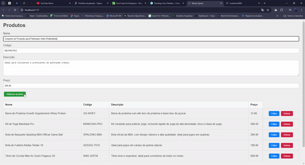

# Nunes Sports Store

O Nunes Sports Store é uma aplicação de gerenciamento de produtos voltada para a venda de artigos esportivos. O sistema permite a criação, visualização, edição e exclusão de produtos, utilizando uma arquitetura de frontend com React e backend integrado com o Supabase e hospedado na Vercel.



## Funcionalidades

- Adicionar Produtos: Permite adicionar novos produtos com nome, código, descrição e preço.
- Visualizar Produtos: Exibe a lista completa de produtos cadastrados.
- Editar Produtos: Permite editar as informações de um produto existente.
- Excluir Produtos: Remove um produto da lista de produtos cadastrados.

## Tecnologias Utilizadas

> Frontend

- React.js: Framework para a construção da interface do usuário.
- Axios: Biblioteca para fazer requisições HTTP ao backend.
- Netlify: Plataforma de hospedagem do frontend.

> Backend

- Node.js com Express.js: Utilizado para criar o servidor backend e definir as rotas da API.
- Supabase: Banco de dados serverless utilizado para gerenciar os dados do sistema.
- Vercel: Plataforma de hospedagem do backend.

> Outros

- CORS: Implementado para permitir a comunicação entre as plataformas Netlify (frontend) e Vercel (backend).
- dotenv: Utilizado para carregar variáveis de ambiente.

## Desafios Enfrentados

> Migração do MySQL para o Supabase:

- Desafio: A migração para um banco de dados serverless exigiu a adaptação de queries e a implementação de novas políticas de segurança no banco.
- Solução: Refatoramos o código para usar o Supabase, implementamos políticas de inserção e seleção de dados, e configuramos o id dos produtos como auto incremento.

> Problemas com CORS:

- Desafio: Durante a integração do frontend e backend, encontramos problemas com bloqueios CORS.
- Solução: Ajustamos as permissões no middleware CORS no backend para aceitar requisições vindas dos domínios Netlify e Vercel.

## Inicialização do Projeto

> Requisitos

- Node.js >= 14.x
- npm >= 6.x

> Front-end

Instale as dependências:

```text
npm install
```

Inicie o servidor de desenvolvimento:

```text
npm run dev
```

## Contato

- E-mail: <adrianemaciel.developer@gmail.com>
- Linkedin: <https://linkedin.com/in/adrianemacieldeveloper/>
